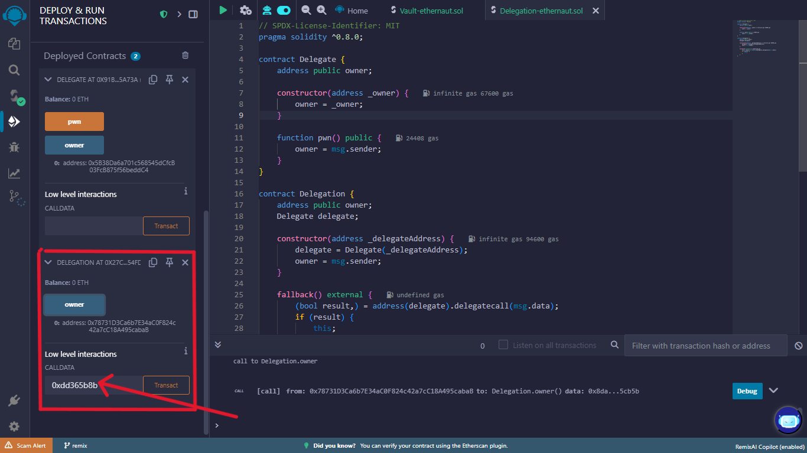

# Level 6 : Delegation Contract

## Contract 

```Solidity
// SPDX-License-Identifier: MIT
pragma solidity ^0.8.0;

contract Delegate {
    address public owner;

    constructor(address _owner) {
        owner = _owner;
    }

    function pwn() public {
        owner = msg.sender;
    }
}

contract Delegation {
    address public owner;
    Delegate delegate;

    constructor(address _delegateAddress) {
        delegate = Delegate(_delegateAddress);
        owner = msg.sender;
    }

    fallback() external {
        (bool result,) = address(delegate).delegatecall(msg.data);
        if (result) {
            this;
        }
    }
}
```
## Contract Overiew

- ### Delegate Contract
    - It has a public variable `owner` which is an address type.

    - A `Constructor` that takes the input `_owner`(address type) from the user , that will assigned to the state variable `owner` . 
        `owner = _owner`

    -  And a public  function `pwn()` that changes the current `owner` . The one  who called the function `pwn()` becomes the `owner`. That is msg.sender becomes the owner .
        - `owner = msg.sender`  

- ### Delegation Contract     
    - It has a public variable `owner` which is an address type.

    - An instance `delegate` of `Delegate` contract  is created .

    - A `Constructor` that takes input  `_delegateAddress` where the `Delegate` contract is deployed .
        - the instance `delegate` is assigned to the  address where the the `Delegate` contract is deployed.

            `delegate = Delegate(_delegateAddress)`
        
        - `owner` is assgigned to the `msg.sender`.

    - And an `external` `fallback()` function : 

        - For full explanation of `fallback` function in solidity [fallback()](/blog/DelegateCall_and_FallbackFunction)

        - `(bool result,)=address(delegate).delegatecal(msg.data)`
            - In this function `delegatecall()` ( For full explanation of delegatecall click on it  [delegatecall](/blog/DelegateCall_and_FallbackFunction)) is used to call the functions of `Delegate` contract within the context of `Delegation` contract.

            - This is the core of the interaction. It performs a `delegatecall` to the contract whose address is stored in the `delegate` variable. 

                - `address(delegate)`: Converts the `delegate` contract instance to its address.

                - `.delegatecall(msg.data)`: Executes the code of the `delegate` contract using the `msg.data` (the function selector and arguments of the call to `Delegation`). Importantly, this execution happens in the context of the `Delegation` contract, meaning it operates on the `Delegation` contract's storage

                - `(bool result,)` = ...: The `delegatecall` returns a boolean `result` indicating whether the call was successful and the return data (which we are ignoring here with the `,`).

        - `if (result) { this; }`: This line is a bit unusual. If the `delegatecall` is successful, it references this (the `Delegation` contract instance). This doesn't have any direct effect on the state or execution flow. It's likely a no-op or a stylistic choice that doesn't alter the core vulnerability.

## Challenge 

The goal of this level is for you to claim ownership of the instance you are given.

## The Vulnerability 

**Ownership Takeover via delegatecall**

The crucial point here is the `delegatecall` in the `Delegation` contract's `fallback` function. When you call a function on `Delegation` that doesn't exist in `Delegation` itself, the call is forwarded to the `Delegate` contract via `delegatecall.`

Now, consider what happens if you call the `pwn()` function on the `Delegation` contract. Since `Delegation` doesn't have a `pwn()` function, the `fallback` function is executed. This `fallback` function then uses `delegatecall` to execute the code of the `Delegate` contract's `pwn()` function within the storage context of the `Delegation` contract.

Inside the `pwn()` function of the `Delegate` contract, the line `owner = msg.sender;` is executed. Because this execution happens within the context of `Delegation` due to `delegatecall`, it's the `owner` variable of the `Delegation` contract that gets modified to the `msg.sender` of the transaction that triggered the `fallback`.

Therefore, even though the `pwn()` function is defined in the `Delegate` contract, by calling a non-existent function (like `pwn()`) on the `Delegation` contract, you can effectively change the `owner` of the `Delegation` contract to your own address.

In essence:

    - You call a function (e.g., `pwn()`) on the `Delegation` contract.

    - `Delegation` doesn't have this function, so its `fallback()` is triggered.

    - The `fallback()` uses `delegatecall` to execute the `pwn()` function from the `Delegate` contract.

    - The `pwn()` function's code `(owner = msg.sender;)` modifies the `owner` state variable of the `Delegation` contract because of `delegatecall`.

## solution 

- So, as per challenge to gain the ownership of the `Delegation` contract , Go through these steps (Remix Ide)

    1. deploy the `Delegate` contract with Address A

    2. Deploy the `Delegation` contract by passing the `_delegateAddress` (the address where the `Delegate` is deployed ) with Adddress B.

    3. Now calculate the `Keccak256` of the function name `pwn()` , which you want to call to change the `owner`, using online tools. 

        `dd365b8b15d5d78ec041b851b68c8b985bee78bee0b87c4acf261024d8beabab`

    4. The function selector is the first 4 bytes (8          hexadecimal characters) of this hash. Therefore, the function selector for `pwn()` is:

        `0xdd365b8b`

    5. Now enter the function selector `0xdd365b8b` in the calldata section that has  input field transact . see image below 
         

    6. Hit the `transact` with address that you want to make as `owner`.

        - When we enter the function selector of `pwn()` and hit the transact button , it checks for the function that matches with that function selector, if it  doesn't exists , the `fallback()` function is called that calls the `pwn()` in the context of `Delegation` contract , so in that `pwn()` function 

            `owner = msg.sender`

        the `msg.sender` will be the one who hit the transact and that is assigned to the state variable(of the `Delegation` contract) `owner`. so the owner of the `Delegation` is Changed.

    7. Now check the Owner of the `Delegation`.

    8. Hence Gained the Ownership of the `Delegation` contract . 

## What I learnt 

1. `Fallback Function` :

    - A contract can have at most one unnamed fallback function. It's executed when a call is made with no data or to a non-existent function. It must be external and can be payable to receive Ether.

2. `Delegatecall` :

    - delegatecall is a low-level function to execute code from another contract in the calling contract's context (storage, msg.sender, msg.value). It's crucial for proxy patterns but carries risks of storage collisions and security vulnerabilities.