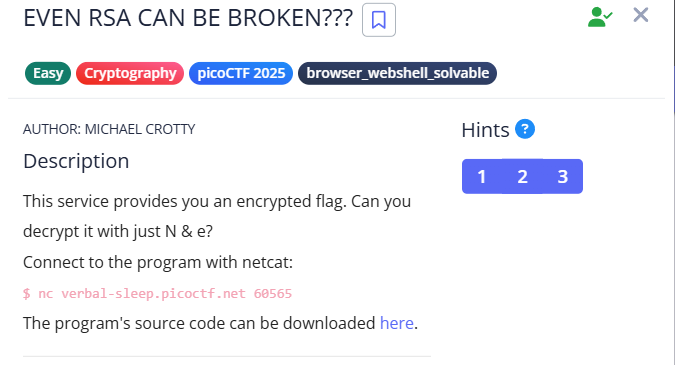

**CHALLENGE** :
[https://play.picoctf.org/practice/challenge/470?category=2&page=1](https://play.picoctf.org/practice/challenge/470?category=2&page=1)



**Program's Source Code  (given) :** 
```python 
from sys import exit
from Crypto.Util.number import bytes_to_long, inverse
from setup import get_primes

e = 65537

def gen_key(k):
    """
    Generates RSA key with k bits
    """
    p,q = get_primes(k//2)
    N = p*q
    d = inverse(e, (p-1)*(q-1))

    return ((N,e), d)

def encrypt(pubkey, m):
    N,e = pubkey
    return pow(bytes_to_long(m.encode('utf-8')), e, N)

def main(flag):
    pubkey, _privkey = gen_key(1024)
    encrypted = encrypt(pubkey, flag) 
    return (pubkey[0], encrypted)

if __name__ == "__main__":
    flag = open('flag.txt', 'r').read()
    flag = flag.strip()
    N, cypher  = main(flag)
    print("N:", N)
    print("e:", e)
    print("cyphertext:", cypher)
    exit()
```
---


Executed `nc verbal-sleep.picoctf.net 60565` in terminal to connect to the challenge server

```terminal
sunil-kumar@DESKTOP-GBKN3LB:~$ nc verbal-sleep.picoctf.net 60565                                                                                                 

N:22112698953749063109617592166620913818275148140617108348989655249575043047089637270372618525184162089013302540284103055407597480046872073239547197567906818          

e:65537                                           

cyphertext:2013148744206391195361764593325001979080921842718197486889962819056091262679808492399271864230029041559023832822027589585282050922887174003409831450203737 
```
And I got the `N` , `e` and `c`(cipher text)

After observing the `Source Code` , I found that the `N` value is about `1024` bits (**Weakness 1** / vulnerability 1 of this implementation) , and that can be easily factorize in 2025 (at present).So I went for the online tool [Alpertron](https://www.alpertron.com.ar/ECM.HTM) and factorized it . That gave me four divisors :
    - 1 
    - 2
    - 11056349476874531554808796083310456909137574070308554174494827624787521523544818635186309262592081044506651270142051527703798740023436036619773598783953409
    - N itself.

So after seeing those results the `p` & `q`( these are the prime numbers , use to get the value of `N` using the formula `N = p * q` ) values might be the 2nd and the 3rd one among the four divisors. But initially I was a bit confused about p value because in the source code it is mentioned that `p,q` are about 512 bits each. But I wanted to check whether  multiplying `p` and `q` gets our `N` or not  , and I got it exactly. Finally we have values of p , q , c , e , N .

So , to decrypt the `c` cipher text , we have a formula :
```math
m = c^d mod n  where m - original message 
```
Here we need `d` and  to get that we use 
```math
d * e ≡ 1 mod φ(n)
```
So we need to find the inverse of `e mod φ(n)` and that's very easy in python . But wait!  we dont have `φ(n)` . So how do we find it?

We can find `φ(n)` using the formula :
```math
φ(n) = (p-1) * (q-1)
```
⚠️ While analyzing the challenge, I noticed that `N` is even (**Weakness 2**) — which immediately got my attention . In RSA, the product `N = p * q` should be odd if both `p` and `q` are large random primes. The only possible way for `N` to be even is if one of the primes is `2`. Since 2 is the only even prime, I assumed `p = 2` and computed `q = N // 2`, effectively factoring `N` instantly and exposing the private key

**Here is the script that decrypts the message**
```python
from Crypto.Util.number import inverse
from Crypto.Util.number import long_to_bytes
n = 22112698953749063109617592166620913818275148140617108348989655249575043047089637270372618525184162089013302540284103055407597480046872073239547197567906818 
e = 65537 
q = 0 
p = 2 
c = 2013148744206391195361764593325001979080921842718197486889962819056091262679808492399271864230029041559023832822027589585282050922887174003409831450203737 
if (n % 2 == 0):
  q = n // 2
  # print (q)

phi_n = (p-1)*(q-1)
d = inverse(e, phi_n)
# print(d)
m = pow(c , d , n)
message = long_to_bytes(m).decode('utf-8')
print(message)
```
And this script got me the flag.
**FLAG :** `picoCTF{tw0_1$_pr!m3f81fef0a}`