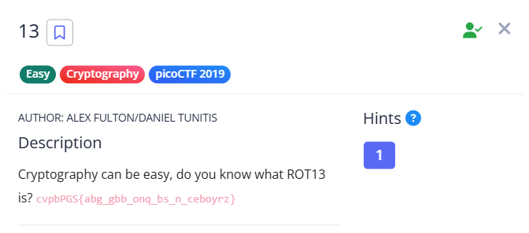

**CHALLENGE :**
[https://play.picoctf.org/practice/challenge/62?category=2&page=1](https://play.picoctf.org/practice/challenge/62?category=2&page=1)



As the challenge name suggests, the flag is encrypted using **ROT13** method .
So, we can directly write a script to decrypt the flag.  

```python
enc_flag ="cvpbPGS{abg_gbb_onq_bs_n_ceboyrz}"
flag = ""

for i in enc_flag:
  if('a' <= i <= 'z'):
    shifted = ((ord(i) - ord('a'))+13 ) % 26 +ord('a')
    flag+=chr(shifted)
  elif('A' <= i <= 'Z'):
    shifted = ((ord(i) - ord('A'))+13 ) % 26 +ord('A')
    flag+=chr(shifted)
  else:
    flag+=i

print(flag)
```
And I got the flag 

**FLAG :** ` picoCTF{not_too_bad_of_a_problem} `

 